<br>
# Create Google Cloud HTTP(S) Load Balancing with session affinity   
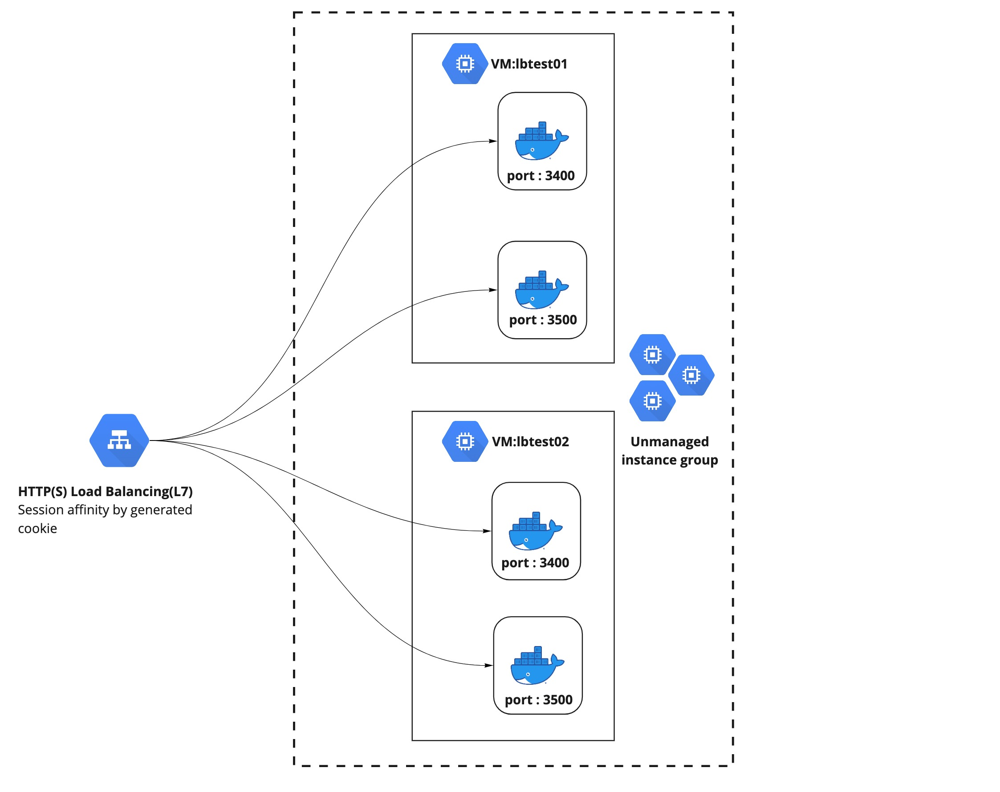 
# Step 0 - prerequisite
0.1 - Installing Google Cloud SDK : https://cloud.google.com/sdk/docs/install
# Step 1 — Authorize gcloud to access the Cloud Platform with Google user credentials
```bash
gcloud auth login
```
# Step 2 — Set Default Project,Region,Zone
```bash
#Set,Get default project
$ gcloud config set project neo-loan
$ gcloud config get-value project
neo-loan

#List config
$ gcloud config list
[compute]
region = asia-east1
zone = asia-east1-b
[core]
account = kitti.s@blockfint.com
disable_usage_reporting = False
project = neo-loan

#Set dault region,sone
$ gcloud config set compute/region asia-southeast1
$ gcloud config set compute/zone asia-southeast1-b

#list config after set
gcloud config list                                                                                                               ok  Thinker gcloud  12:48:04 
[compute]
region = asia-southeast1
zone = asia-southeast1-b
[core]
account = kitti.s@blockfint.com
disable_usage_reporting = False
project = neo-loan

Your active configuration is: [default]
```
# Step 3 — List Image,Machine type that region available   
> this step require install Ubuntu 20.04 LTS on size e2-medium
```
$ gcloud compute images list|grep ubuntu-2004-lts
ubuntu-2004-focal-v20210927                           ubuntu-os-cloud      ubuntu-2004-lts                               READY
$ gcloud compute machine-types list|grep e2-medium|grep asia-southeast
...
e2-medium         asia-southeast1-b          2     4.00
...
```
# Step 4 — Create 2 VMs
```bash
$ (
#Create VM:lbtest01
gcloud compute instances create lbtest01 \
--image=ubuntu-2004-focal-v20210927 \
--image-project=ubuntu-os-cloud \
--machine-type=e2-medium
#Create VM:lbtest02
gcloud compute instances create lbtest02 \
--image=ubuntu-2004-focal-v20210927 \
--image-project=ubuntu-os-cloud \
--machine-type=e2-medium)
...
Created [https://www.googleapis.com/compute/v1/projects/neo-loan/zones/asia-southeast1-b/instances/lbtest01].
NAME      ZONE               MACHINE_TYPE  PREEMPTIBLE  INTERNAL_IP  EXTERNAL_IP    STATUS
lbtest01  asia-southeast1-b  e2-medium                  10.148.0.63  34.126.88.251  RUNNING
Created [https://www.googleapis.com/compute/v1/projects/neo-loan/zones/asia-southeast1-b/instances/lbtest02].
NAME      ZONE               MACHINE_TYPE  PREEMPTIBLE  INTERNAL_IP    EXTERNAL_IP    STATUS
lbtest01  asia-southeast1-b  e2-medium                  10.148.0.63  34.126.88.251  RUNNING
...
#List VMs
$ gcloud compute instances list
NAME                                         ZONE               MACHINE_TYPE   PREEMPTIBLE  INTERNAL_IP    EXTERNAL_IP     STATUS
lbtest01                                     asia-southeast1-b  e2-medium                   10.148.0.63    34.126.88.251   RUNNING
lbtest02                                     asia-southeast1-b  e2-medium                   10.148.15.192  35.240.151.51   RUNNING
```
>>https://cloud.google.com/compute/docs/instances/create-start-instance#startinstancegcloud
# Step 5 — Install docker,docker-compose both lbtest01,lbtest02
```bash
#Install docker
$ sudo apt update
$ sudo apt install apt-transport-https ca-certificates curl software-properties-common -y
$ curl -fsSL https://download.docker.com/linux/ubuntu/gpg | sudo apt-key add -
$ sudo add-apt-repository "deb [arch=amd64] https://download.docker.com/linux/ubuntu focal stable"
$ sudo apt update
$ apt-cache policy docker-ce
$ sudo apt install docker-ce -y
$ sudo systemctl status docker --no-pager
$ sudo usermod -aG docker ${USER}
$ sudo docker info
#Install docker-compose
$ sudo apt install jq -y
$ compose_version=$(curl https://api.github.com/repos/docker/compose/releases/latest | jq .name -r)
$ output='/usr/local/bin/docker-compose'
$ sudo curl -L https://github.com/docker/compose/releases/download/$compose_version/docker-compose-$(uname -s)-$(uname -m) -o $output
$ sudo chmod +x $output
$ docker-compose --version
```
# Step 6 — Runnig simple node.js application both lbtest01,lbtest02
```bash
$ git clone https://github.com/kittisuw/gcp-load-balancing-session-affinity.git
$ cd testapp
#Run container and specific project name
$ docker-compose -p testapp up -d --build
[+] Running 3/3
...

#Check container run inside this project
$ docker-compose -p testapp ps
NAME                COMMAND                  SERVICE             STATUS              PORTS
web01               "docker-entrypoint.s…"   web01               running             0.0.0.0:3400->8080/tcp, :::3400->8080/tcp
web02               "docker-entrypoint.s…"   web02               running             0.0.0.0:3500->8080/tcp, :::3500->8080/tcp

#Testing call container using http
curl -i 0:3400
curl -i 0:3500
```
> Stop container of this project :$ docker-compose -p testapp stop   
> Rebuild with run container:$ docker-compose -p testapp up -d --build
# Step 7 —  Creat Loadbalance
## 7.1 - Create Unmanage Instace group for grouping 2 VMs name uig01   
7.1.1 - Click Create instance group   

     
7.1.2 - Click New Unmanaged Instance group
- name : ug-01
- Location : #Region and Zone that VMs are locate
- Port numbers : #Port of container
- VM instance : #Destination VMs that you would like to add in group

   
> limitation of Unmanage Instance group is all VMs instance are locate only one zone   

## 7.2 - Create HTTP Load balance(L7)      
7.2.1 Click "CREATE LOAD BALANCER"
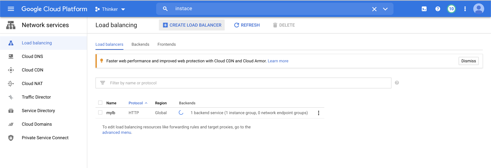   
7.2.2 On HTTP(s) Load balancing Click "START CONFIGURATION"
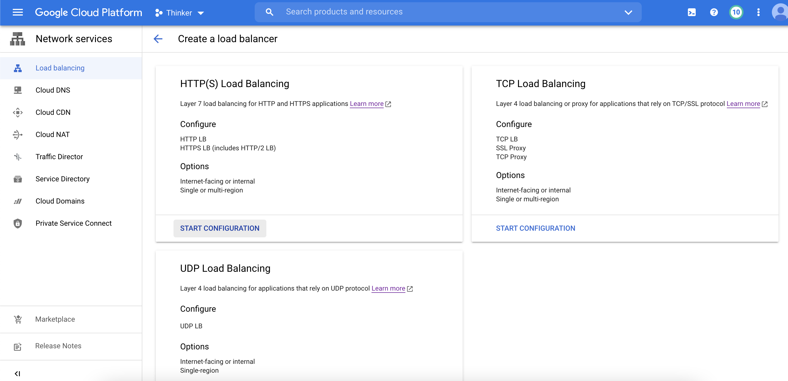   
7.2.3 Select option "From Internet to my VMs"
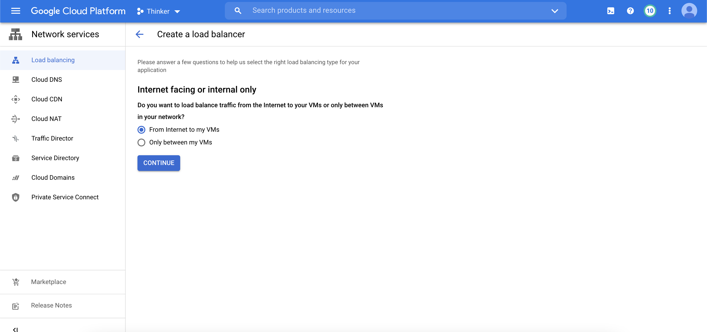 
7.2.4 Create backend service
 - Name: be01   
 - Backend type: Instance group   
 - Instancge group: uig-01 #instance group that you create in step 7.1    

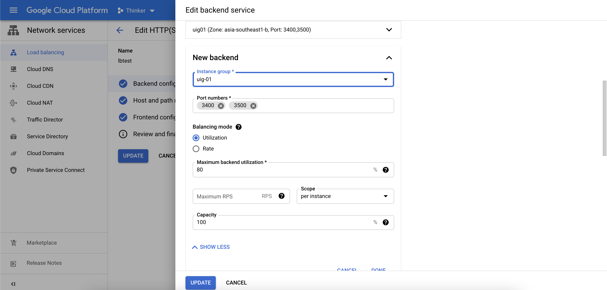  

7.2.5 Add Helth Check thate represent your vm is available Eg. port 3400 is first container port
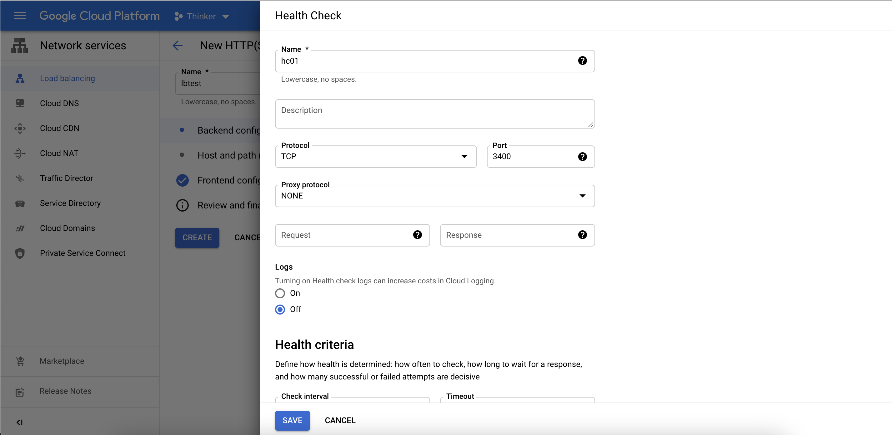   
7.2.6 Click ADVANCED CONFIGURATIONS > Session Affinity > Genarated Cookie
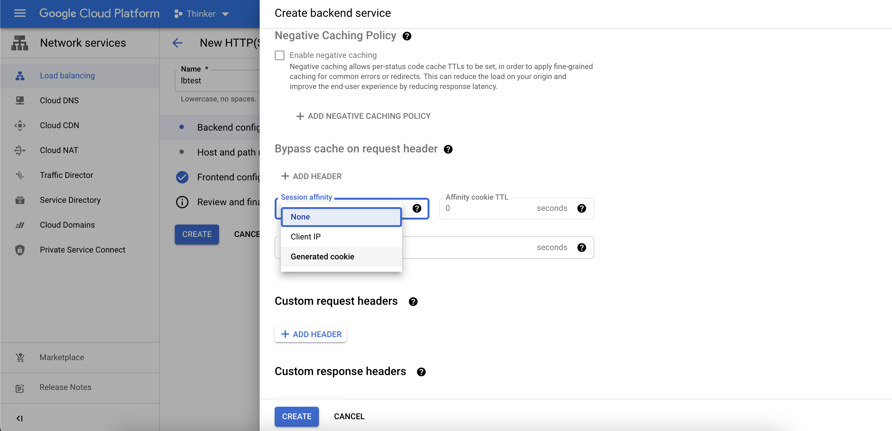 
7.2.7 Select backend service
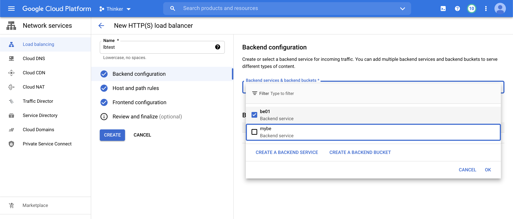 
7.2.8 skip Host and path Rule #if you would like to add routing host,path base config this step
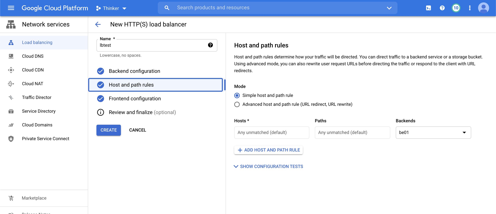 
7.2.9 Config Frontend 
 - name: fe-https
 - protocal : https
 - ip address : #don't use ephemeral be using reserve public ip
 - certificate # google allow using 2 type 1. self sign 2.google-managed certificate
  
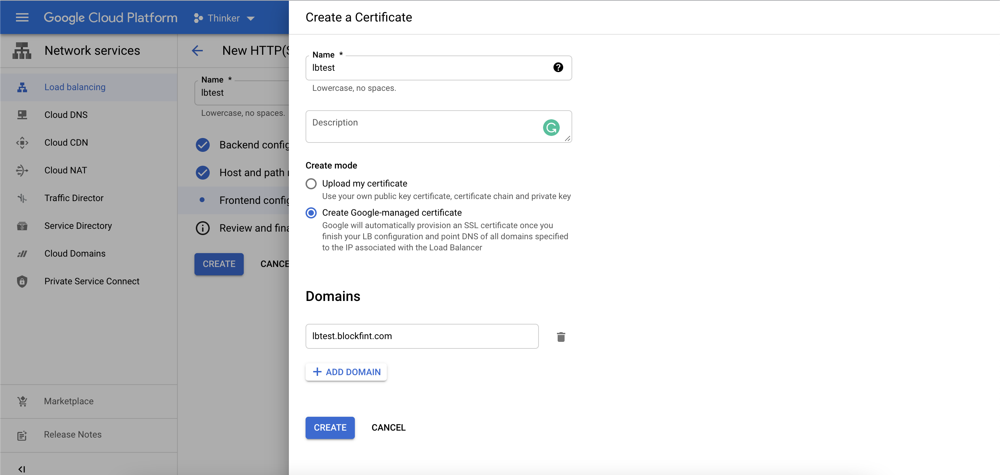   

7.2.10 Click create
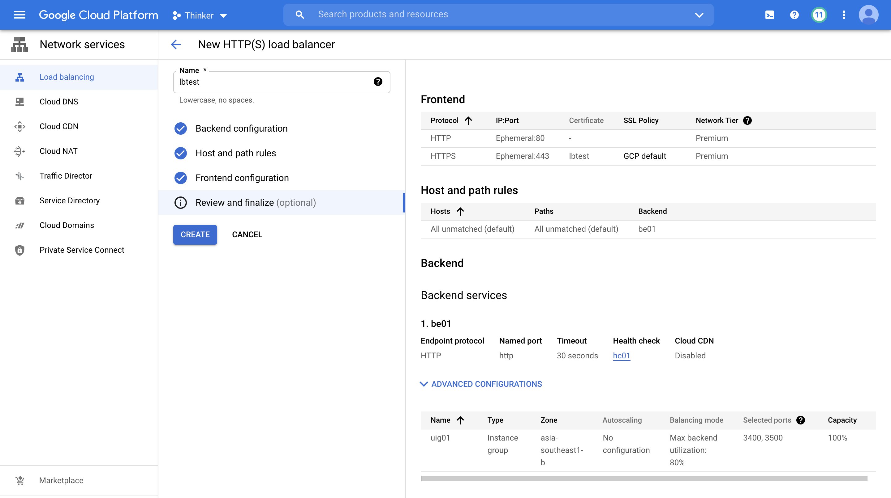 

7.2.11 mapping domain with load balance public ip and testing
# Clean up
```bash
(gcloud compute instances delete --zone "asia-southeast1-b" lbtest01
gcloud compute instances delete --zone "asia-southeast1-b" lbtest02)
```